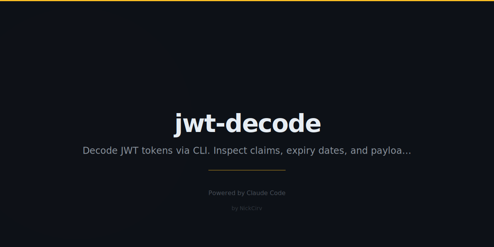

# jwt-decode

Decode and inspect JWT tokens — header, payload, claims, expiry, formatting.

**Never verifies signatures. Zero external dependencies.**

```
jwt-decode eyJhbGciOiJIUzI1NiIsInR5cCI6IkpXVCJ9.eyJzdWIiOiJ1c2VyXzEyMyIsImlzcyI6Imh0dHBzOi8vYXV0aC5leGFtcGxlLmNvbSIsImV4cCI6MTc3MjUzNzc1MX0.fakesig
```

```
── JWT Token ────────────────────────────────────────────────────
   Total: 190B  │  Header: 36B  │  Payload: 131B  │  Signature: 7B

┌─ Header
│  Algorithm     HS256
│  Type          JWT
│
├─ Payload
│  Subject       user_123
│  Issuer        https://auth.example.com
│  Expires       2026-03-03 11:35:51 UTC  (expires in 2h 0m)
│
└─ Signature
   Algorithm: HS256
   NOT VERIFIED — decode only, no secret used
```

## Install

```bash
npx jwt-decode <token>
```

Or install globally:

```bash
npm install -g jwt-decode
```

Requires Node.js >= 18. Zero dependencies — built-ins only.

## Usage

```bash
# From argument
jwt-decode eyJhbGciOiJIUzI1NiIsInR5cCI6IkpXVCJ9...

# From stdin
echo "eyJhbGci..." | jwt-decode

# From file
jwt-decode --file token.txt

# From clipboard (pbpaste / xclip / xsel)
jwt-decode --clipboard
```

## Options

| Flag | Description |
|------|-------------|
| `--format tree\|table\|json` | Output format (default: tree) |
| `--json` | Shorthand for `--format json` |
| `--claim <key>` | Extract a single claim value |
| `--check-expiry` | Exit 1 if expired, exit 0 if valid |
| `--no-color` | Disable color output |
| `--help`, `-h` | Show help |

## Examples

### Decode a token

```bash
jwt-decode eyJhbGciOiJIUzI1NiIsInR5cCI6IkpXVCIsImtpZCI6ImtleS1pZC0wMDEifQ.eyJzdWIiOiJ1c2VyX2FiYzEyMyIsImlzcyI6Imh0dHBzOi8vYXV0aC5leGFtcGxlLmNvbSIsImF1ZCI6ImFwaS5leGFtcGxlLmNvbSIsImVtYWlsIjoiYWxpY2VAZXhhbXBsZS5jb20iLCJleHAiOjE3NzI1Mzc3NTF9.fakesig
```

### Extract a single claim

```bash
jwt-decode eyJhbGci... --claim sub
# → user_abc123

jwt-decode eyJhbGci... --claim exp
# → 1772537751  (2026-03-03 11:35:51 UTC — expires in 2h 0m)
```

### Check expiry in scripts

```bash
jwt-decode "$TOKEN" --check-expiry && echo "Proceeding..." || echo "Token expired, re-authenticate"

# Exit codes: 0 = valid, 1 = expired
```

### JSON output (pipe-friendly)

```bash
jwt-decode eyJhbGci... --json
```

```json
{
  "header": { "alg": "HS256", "typ": "JWT", "kid": "key-id-001" },
  "payload": {
    "sub": "user_abc123",
    "iss": "https://auth.example.com",
    "aud": "api.example.com",
    "email": "alice@example.com",
    "exp": 1772537751
  },
  "signature": {
    "algorithm": "HS256",
    "verified": false,
    "note": "Signature not verified — decode only"
  },
  "stats": {
    "total": 334,
    "header": 62,
    "payload": 248,
    "signature": 22
  }
}
```

### Table format

```bash
jwt-decode eyJhbGci... --format table
```

```
  Section    Claim    Value
  -------    -----    -----
  header     alg      HS256
  header     typ      JWT
  payload    sub      user_abc123
  payload    iss      https://auth.example.com
  payload    exp      2026-03-03 11:35:51 UTC  (expires in 2h 0m)
  payload    email    alice@example.com
  signature  status   NOT VERIFIED
```

### Clipboard

```bash
# Copy a JWT to clipboard, then:
jwt-decode --clipboard
jwt-decode --clipboard --claim email
jwt-decode --clipboard --check-expiry
```

## Display Features

- **Color coded**: green = valid/not-expired, red = expired, yellow = expiring in <15min, cyan = header
- **Human-readable timestamps**: `iat`, `exp`, `nbf` shown as ISO date + relative time
- **Expiry banner**: prominent warning if token is expired
- **Token stats**: total, header, payload, and signature lengths in bytes
- **Standard claims labeled**: `sub` → Subject, `iss` → Issuer, `aud` → Audience, etc.
- **Unknown claims**: shown as-is with raw key name

## Security

- **Signature is never verified** — this tool decodes only, no secret required
- **No external network requests** — purely local, offline operation
- **Zero dependencies** — built-in Node.js modules only (`fs`, `path`, `buffer`, `readline`, `child_process`)
- **No token logging** — tokens are decoded in-memory and never written to disk or logs

## Aliases

Both `jwt-decode` and `jwtd` are registered as CLI commands.

```bash
jwtd eyJhbGci...
```

## Requirements

- Node.js >= 18
- No npm install needed (pure built-ins)

## License

MIT
